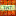

# Minecraft Texture Diffusion Project

This project implements a web application using Flask to interact with a simple diffusion model trained on Minecraft textures. It allows users to browse generated textures and generate new ones based on specific labels.

## Features

- **Web Gallery:** Browse previously generated Minecraft textures.
- **Texture Labeling:** Retrieve a list of available texture labels from the trained model's label map.
- **Image Generation:** Generate new 16x16 Minecraft textures using a simple diffusion model based on a selected label.

## Project Structure

- `app.py`: The main Flask application file, handling web routes (`/`, `/get_labels`, `/list_generated_images`, `/generate`) and interacting with the diffusion model for image generation.
- `prepare_dataset.py`: A script to preprocess raw 16x16 Minecraft texture images from the `minecraft_16x16_block_textures/` directory, create a label map, and save the image data and labels as NumPy arrays (`.npy`).
- `simple_diffusion_model.py`: Contains the definition of the `SimpleUNet` diffusion model architecture, time and label embedding modules, diffusion process helper functions (`linear_beta_schedule`, `extract`), data loading (`TextureDataset`), training (`train`), and sampling (`sample`) functions.
- `minecraft_textures_dataset.npy`: NumPy array containing the preprocessed image data.
- `minecraft_textures_labels.npy`: NumPy array containing the numerical labels corresponding to the images.
- `minecraft_label_map.json`: A JSON file mapping texture names (derived from filenames) to numerical label IDs.
- `simple_diffusion_model.pth`: The saved state dictionary (weights) of the trained `SimpleUNet` diffusion model.
- `minecraft_16x16_block_textures/`: Directory intended to hold the original 16x16 Minecraft block texture PNG files.
- `gallery/`: Directory containing the web gallery interface files.
    - `gallery/index.html`: The main HTML page for the gallery, including controls for generation and a display area.
    - `gallery/static/`: Directory for static web assets served by Flask.
        - `gallery/static/style.css`: CSS file for styling the web gallery.
        - `gallery/static/script.js`: JavaScript file handling client-side interactions, fetching labels, triggering generation, and displaying images.
    - `gallery/generated_images/`: Directory where generated images are saved by `app.py` and served statically.
- `texture_data/`: Potentially used for intermediate data during dataset preparation or other processes (contents not explicitly detailed in provided file list).

## Example Images

Here are examples of the original texture and the corresponding generated texture:





## Setup and Installation

1.  **Clone the repository:**
    ```bash
    git clone <repository_url>
    cd mctexture
    ```
2.  **Create a virtual environment (recommended):**
    ```bash
    python -m venv .venv
    ```
3.  **Activate the virtual environment:**
    - On Windows:
      ```bash
      .venv\Scripts\activate
      ```
    - On macOS/Linux:
      ```bash
      source .venv/bin/activate
      ```
4.  **Install dependencies:**
    ```bash
    pip install Flask Flask-Cors torch torchvision Pillow numpy
    ```
    *(Note: You may need to install a specific version of `torch` compatible with your CUDA setup if you plan to use a GPU. Refer to the official PyTorch documentation for installation instructions.)*
5.  **Prepare the dataset:**
    Ensure your 16x16 Minecraft texture PNG files are placed inside the `minecraft_16x16_block_textures/` directory. Then, run the `prepare_dataset.py` script to process them and create the necessary `.npy` data/label files and the `minecraft_label_map.json`.
    ```bash
    python prepare_dataset.py
    ```
6.  **Obtain the trained model:**
    Place the `simple_diffusion_model.pth` file in the project root directory. This file contains the trained weights for the diffusion model and is required by `app.py`. This file is typically generated by training the model using `simple_diffusion_model.py` (by uncommenting and running the training block) or obtained as a pre-trained file.

## Usage

1.  **Activate your virtual environment** (if not already active).
2.  **Run the Flask application:**
    ```bash
    python app.py
    ```
    The application will start, loading the model and label map.
3.  **Access the web gallery:**
    Open your web browser and go to `http://127.0.0.1:5000/`. You should see the gallery interface, populated with available texture labels. You can select a label and click "Generate Texture" to create a new image.

## API Endpoints

-   `GET /get_labels`: Returns a JSON object containing the mapping of label IDs to texture names, derived from `minecraft_label_map.json`.
-   `GET /list_generated_images`: Returns a JSON object containing a list of relative URLs for images found in the `gallery/generated_images/` directory.
-   `POST /generate`: Accepts a JSON body with a single key, `label_id` (integer), corresponding to the desired texture label. It triggers the diffusion model to generate an image for that label, saves it to `gallery/generated_images/`, and returns a JSON object with the `image_url` of the newly created image.
